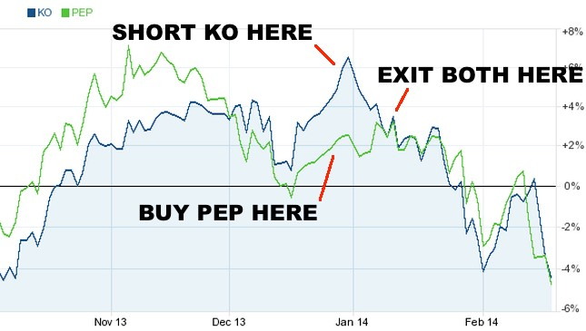

# High Frequency Trading using Support Vector Machines
This project implements a high frequency trading strategy that utilizes Support Vector Machines to capture statistical arbitrage in the pricing of Class A and Class C Google stocks. 

This idea is heavily inspired by the following paper: http://cs229.stanford.edu/proj2015/028_report.pdf by Jiayu Wu. This project includes modifications into an actual trading strategy that uses rebalancing. 

TODO: Further Model Tuning

TODO: Model Explanations

TODO: Results Graphs

TODO: Diagnostic Graphs on labelling

TODO: Labelled profit vs. Unlabelled profit

## Abstract
D.S. Ehrman defines Pairs Trading as a nondirectional, relative-value investment strategy that seeks to
identify two companies with similar trading characteristics whose equity securities are currently trading at a range outside their historical range. 
This investment strategy entails buying the undervalued security while short-selling the overvalued security; thereby maintaining market neutrality.
The position should be closed once the instruments return to statistical norms, earning the trader a profit. A good pair should share as many the same intrinsic characteristics as possible. 

A canonical example of pairs trading would be with Pepsi and Coca Cola. Barring any drastic shifts in the characteristics of either company, the returns of Pepsi and Coca Cola should be very correlated. 

In our project, we will be searching for pairs trading opportunities between Class A and Class C Google stocks. Since all of the underlying fundamentals of both instruments are similar with the exception of voting rights, this pair makes a very good candidate to explore. 

However, since this pair of of instruments is obviously closely related, many other players in the market are ready to profit off of any mispricings within this pair. It is not expected for any mispricings to be available for a long time. As such, we need to work in a timeframe that is as fast-paced as possible. That is why we will be using a fast-paced high frequency pairs trading strategy to capture statistical arbitrage within the pricing of GOOGL and GOOG as soon as they occur. In our project, we will be creating features from the ticker data that we feed into a machine learning model to predict profitable pairs trading opportunities. 

## Dataset
Our dataset contains snapshots of GOOG and GOOGL over the span of roughly 2 years (10/2016 - 11/2018) at the minute-level resolution. 
Our data was gathered from QuantQuote.com, a reputable dealer of fine-resolution ticker datasets. 
Our dataset had some missing values for both tickers. From QuantQuote's website: "Missing data for certain minutes generally means that no trades occurred during that minute." 
We handled this by removing entries from both datasets in which at least 1 of the tickers had a missing entry. The reasoning behind this was that is that pairs trading is impossible in such instances. This only occured for about 0.1% of our dataset. 

## Pairs Trading Model
The canonical pairs trading spread model looks like: 

where  represents the returns of instrument  at time  and 
 represents the returns of instrument  at time . 

 represents the spread of the returns at time . One of the assumptions of this model 
is the fact that this residual term is mean-reverting. We can assume this especially since the intrinsic characteristics 
of both securities in this instance are very similar. 

 represents the drift term. Sometimes the spread begins to trend instead of reverting to the original mean. The drift term is one of the biggest factors of risk in pairs trading. For our problem, we assume that the drift term is negligible compared to the returns of either instrument. 

 represents the hedge ratio which serves to normalize the volatility between the instruments. 
 tells us how much of instrument  to long/short for every 1 unit of  to long/short, creating a risk neutral position. We will use the close prices to calculate percent returns and for the other features. Past work has considered assumed that  remains constant over the duration of the dataset. For our dataset, however, different behavior in the spread is apparent in 2017 and 2018. This might be due to some change of intrinsic characteristics of the instruments. For our solution, we will assume treat  as variable and recalculate it periodically. 

## Ornstein-Uhlenbeck(OU) Stochastic Process

The Ornstein-Uhlenbeck Stochastic Process is used in finance to model the volatility of the underlying asset price process. The process can be considered to be a modification of the random walk (Weiner Process) in which the properties of the process have been changed so that there is a tendency to walk back towards a central location. The tendency to move back towards a central location is greater when the process is further away from the mean. Thus, this process is called "mean-reverting", and has many direct applications in pairs trading. 

The OU process satisfies the following stochastic differential equation: 
